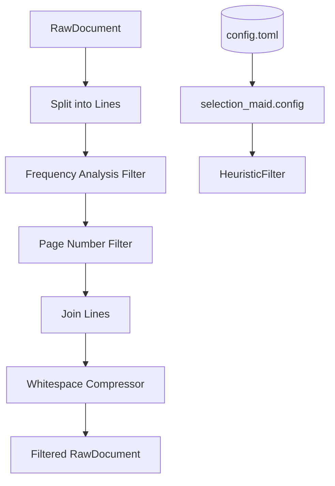

# Phase 03: Content Filtering - Research

**Researched:** 2026-05-24
**Domain:** Document content cleaning and normalization (Markdown)
**Confidence:** HIGH

## Summary

Phase 03 implements the `HeuristicFilter`, a concrete implementation of `FilterPort` designed to remove structural noise from the Markdown extracted by Phase 02. The filter addresses three main types of noise: repetitive headers/footers (via frequency analysis), isolated page numbers (via regex), and excessive whitespace (via normalization). Additionally, a central configuration module `selection_maid.config` is introduced to manage project-wide settings using `config.toml`.

**Primary recommendation:** Implement `HeuristicFilter` using standard library tools (`re`, `collections.Counter`, `tomllib`) to maintain a zero-dependency domain while achieving high-fidelity cleaning of Markdown blobs.

## Architectural Responsibility Map

| Capability | Primary Tier | Secondary Tier | Rationale |
|------------|-------------|----------------|-----------|
| Noise Filtering | API / Backend | — | Content cleaning is a business logic requirement to ensure chunk quality. |
| Configuration Management | API / Backend | — | Centralized config is a cross-cutting concern for all adapters. |
| Markdown Normalization | API / Backend | — | Standardizing output for downstream consumers (Vector DBs). |

## Standard Stack

### Core
| Library | Version | Purpose | Why Standard |
|---------|---------|---------|--------------|
| `tomllib` | Stdlib (3.11+) | TOML configuration parsing | Official Python standard for TOML reading; zero external dependencies. [VERIFIED: docs.python.org] |
| `re` | Stdlib | Regex-based pattern matching | Essential for page number detection and whitespace compression. [VERIFIED: docs.python.org] |
| `collections.Counter` | Stdlib | Frequency analysis | Highly efficient for counting repeated lines in large documents. [VERIFIED: docs.python.org] |

### Supporting
| Library | Version | Purpose | When to Use |
|---------|---------|---------|-------------|
| `dataclasses.replace` | Stdlib | Immutable object updating | Creating a new `RawDocument` from the filtered content. [VERIFIED: docs.python.org] |

### Alternatives Considered
| Instead of | Could Use | Tradeoff |
|------------|-----------|----------|
| `tomllib` | `tomli` | `tomli` is for Python < 3.11. Project uses 3.13+, so `tomllib` is preferred. |
| Regex for whitespace | String `split`/`join` | Regex is more concise for multi-newline sequences (`\n{3,}`). |

**Installation:**
No new packages required for this phase.

**Version verification:**
```bash
python3 --version  # Verified: Python 3.14.5 (>=3.11 required for tomllib)
```

## Package Legitimacy Audit

No external packages are introduced in this phase.

## Architecture Patterns

### System Architecture Diagram



### Recommended Project Structure
```
src/selection_maid/
├── adapters/
│   └── filter/
│       ├── __init__.py
│       └── heuristic.py      # HeuristicFilter implementation
├── config.py                 # Central configuration module
tests/adapters/filter/
└── test_heuristic_filter.py  # Unit tests for filtering logic
```

### Pattern 1: Frequency-Based Noise Detection
**What:** Identify lines that repeat across the document as headers/footers.
**When to use:** When page boundaries are absent in the processed Markdown blob.
**Example:**
```python
# Based on Decision D-32
from collections import Counter

def get_repeated_lines(lines, min_repeat=3, max_len=80):
    # Candidate selection (D-32, D-33)
    candidates = [
        line.strip() for line in lines 
        if len(line.strip()) <= max_len 
        and not line.strip().startswith("#") 
        and "|" not in line
    ]
    counts = Counter(candidates)
    return {line for line, count in counts.items() if count >= min_repeat}
```

### Anti-Patterns to Avoid
- **Greedy Filtering:** Removing lines that repeat but are legitimate (e.g., headings or table rows). Avoided by D-33 exclusions.
- **In-place Mutation:** Modifying the input `RawDocument`. Avoided by using `dataclasses.replace` to return a new instance (D-06).

## Don't Hand-Roll

| Problem | Don't Build | Use Instead | Why |
|---------|-------------|-------------|-----|
| TOML Parsing | Custom parser | `tomllib` | Standardized, handles edge cases of TOML spec. |
| Frequency Counting | Dictionary-based loop | `collections.Counter` | Performance and readability. |
| Whitespace Normalization | Manual loop over chars | `re.sub(r'\n{3,}', '\n\n', ...)` | Faster execution and clearer intent. |

## Common Pitfalls

### Pitfall 1: Binary Mode for tomllib
**What goes wrong:** `tomllib.load()` raises `TypeError` if passed a text file handle.
**Why it happens:** The library expects binary input (bytes) as per TOML specification.
**How to avoid:** Always open `config.toml` with `mode="rb"`.

### Pitfall 2: False Positive in Roman Numerals
**What goes wrong:** Common words like "CIVIC" or short names like "LI" might be detected as Roman numeral page numbers.
**How to avoid:** Implement length limits (e.g., 1-10 characters) and ensure the line is isolated (stripped line matches regex exactly).

## Code Examples

### Page Number Regex (D-35)
```python
import re

# Arabic numbers: 1, 42, 100
ARABIC_RE = re.compile(r"^\d+$")

# Roman numerals: i, iv, XII, viii (max 10 chars)
ROMAN_RE = re.compile(r"^[ivxlcdm]{1,10}$", re.IGNORECASE)

# Hyphenated: - 1 -, -42-, - iv -
HYPHEN_RE = re.compile(r"^-\s*(\d+|[ivxlcdm]{1,10})\s*-$", re.IGNORECASE)

def is_page_number(line: str) -> bool:
    s = line.strip()
    return bool(ARABIC_RE.match(s) or ROMAN_RE.match(s) or HYPHEN_RE.match(s))
```

### Whitespace Compression (D-37)
```python
import re

def compress_whitespace(content: str) -> str:
    # Normalize whitespace-only lines to empty lines
    normalized = "\n".join(line if line.strip() else "" for line in content.splitlines())
    # Compress 3+ newlines to 2 (resulting in exactly 1 blank line between blocks)
    return re.sub(r"\n{3,}", "\n\n", normalized)
```

## Assumptions Log

| # | Claim | Section | Risk if Wrong |
|---|-------|---------|---------------|
| A1 | Frequency count >= 3 is a sufficient proxy for "3+ consecutive pages" | Summary | Low; short documents might retain noise, but core content is safe. |
| A2 | Line length <= 80 chars covers most headers/footers | Pattern 1 | Low; standard A4/Letter margins usually limit header width. |

## Open Questions

1. **How to handle `config.toml` in different environments (dev/prod)?**
   - Recommendation: Use `config.toml` for local/project defaults and consider environment variables for sensitive overrides in Phase 6.

## Environment Availability

| Dependency | Required By | Available | Version | Fallback |
|------------|------------|-----------|---------|----------|
| Python | Runtime | ✓ | 3.14.5 | — |
| tomllib | Config | ✓ | Stdlib | — |

## Validation Architecture

### Test Framework
| Property | Value |
|----------|-------|
| Framework | pytest 9.0.3 |
| Config file | `pyproject.toml` |
| Quick run command | `uv run pytest tests/adapters/filter/test_heuristic_filter.py` |
| Full suite command | `uv run pytest` |

### Phase Requirements → Test Map
| Req ID | Behavior | Test Type | Automated Command | File Exists? |
|--------|----------|-----------|-------------------|-------------|
| FILT-01 | Header/Footer removal | unit | `pytest ...::TestFILT01Headers` | ❌ Wave 0 |
| FILT-02 | Page number removal | unit | `pytest ...::TestFILT02PageNumbers` | ❌ Wave 0 |
| FILT-03 | Whitespace compression | unit | `pytest ...::TestFILT03Whitespace` | ❌ Wave 0 |
| FILT-04 | Content preservation | unit | `pytest ...::TestContentPreservation` | ❌ Wave 0 |

### Wave 0 Gaps
- [ ] `tests/adapters/filter/test_heuristic_filter.py` — New test file required.

## Security Domain

### Applicable ASVS Categories

| ASVS Category | Applies | Standard Control |
|---------------|---------|-----------------|
| V5 Input Validation | yes | Regex constraints for page numbers and frequency checks. |

### Known Threat Patterns for Markdown Filtering

| Pattern | STRIDE | Standard Mitigation |
|---------|--------|---------------------|
| Regex DoS (ReDoS) | Denial of Service | Use simple, non-backtracking regex for page numbers. Avoid nested quantifiers. |

## Sources

### Primary (HIGH confidence)
- `03-CONTEXT.md` - Implementation decisions for Phase 3.
- `src/selection_maid/domain/ports.py` - FilterPort protocol.
- `src/selection_maid/domain/models.py` - RawDocument dataclass.

### Secondary (MEDIUM confidence)
- [Official Python Docs: tomllib](https://docs.python.org/3/library/tomllib.html)
- [Official Python Docs: collections.Counter](https://docs.python.org/3/library/collections.html#collections.Counter)

## Metadata

**Confidence breakdown:**
- Standard stack: HIGH - Pure stdlib usage.
- Architecture: HIGH - Hexagonal patterns established.
- Pitfalls: HIGH - Binary TOML reading and Roman numeral collisions are well-known.

**Research date:** 2026-05-24
**Valid until:** 2026-06-24
