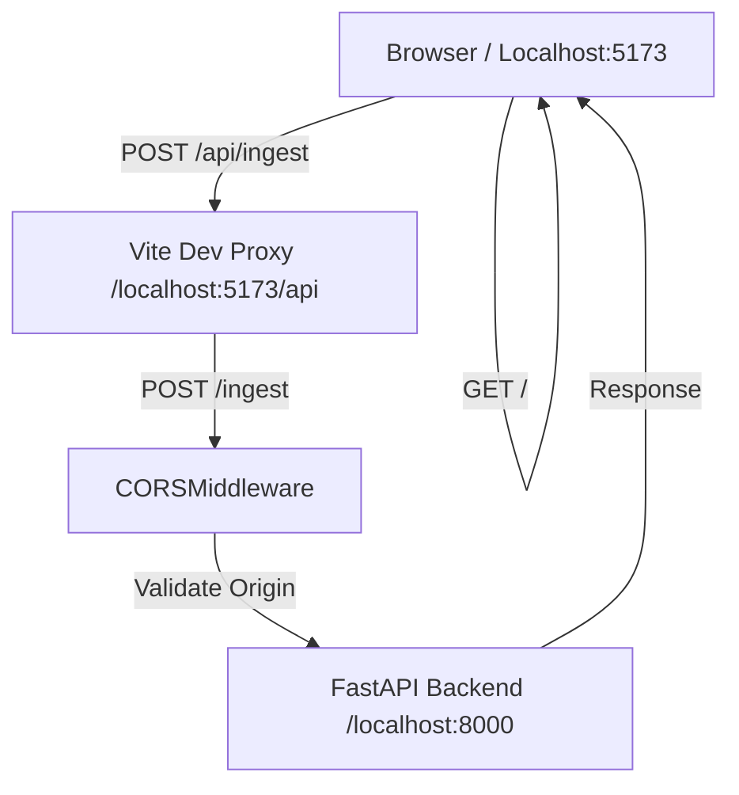

# Phase 8: Backend CORS + Project Scaffold - Research

**Researched:** 2026-05-25
**Domain:** FastAPI, Vue 3, Vite, Tailwind CSS v4, shadcn-vue
**Confidence:** HIGH

## Summary

Phase 8 establishes the foundational bridge between the SelectionMaid backend and the upcoming SPA. It involves two primary tasks: enabling Cross-Origin Resource Sharing (CORS) in the FastAPI application to allow browser-based requests from the local development environment, and scaffolding the frontend project in the `frontend/` directory.

The research confirms that as of 2026, the frontend stack (Vue 3.5, Vite 8, Tailwind v4) has moved toward a more integrated, plugin-driven configuration where Tailwind is handled directly by Vite, and shadcn-vue remains the standard for high-quality, accessible UI components.

**Primary recommendation:** Integrate `CORSMiddleware` directly into the `create_app()` factory in `app.py` and initialize the frontend using `npm create vite@latest` followed by the `@tailwindcss/vite` plugin and `shadcn-vue` CLI.

<user_constraints>
## User Constraints (from CONTEXT.md)

### Locked Decisions
- **D-01:** `CORSMiddleware` permite apenas `allow_origins=["http://localhost:5173"]`. Nenhuma wildcard; nenhuma origem de produção por ora.
- **D-02:** `allow_methods=["POST", "OPTIONS"]`. OPTIONS é necessário para preflight.
- **D-03:** `allow_headers=["*"]` para headers (necessário para `Content-Type: multipart/form-data`).
- **D-04:** O frontend mora em `frontend/` dentro deste repo (monorepo).
- **D-05:** Nome exato da pasta: `frontend/`.
- **D-06:** Vite proxy: `/api` → `http://localhost:8000`, com `rewrite: (path) => path.replace(/^\/api/, '')`.
- **D-09:** Inicializar via CLI oficial: `npx shadcn-vue@latest init`.
- **D-10:** Instalar apenas o componente `Button` na Phase 8.
- **D-11:** Dark mode via Tailwind CSS v4 class strategy (`darkMode: 'class'`).

### the agent's Discretion
- Best way to add `CORSMiddleware` in the current `app.py` structure (D-83/D-84/D-85 patterns).
- Specific commands for initializing Vue 3 + Vite + Tailwind v4 + shadcn-vue.
- How to configure the Vite proxy to handle `/api` -> `localhost:8000` with path rewrite.
- Ensure the shadcn-vue `Button` proof-of-life is planned correctly.

### Deferred Ideas (OUT OF SCOPE)
- Nenhuma — a discussão ficou dentro do escopo da Phase 8.
</user_constraints>

<phase_requirements>
## Phase Requirements

| ID | Description | Research Support |
|----|-------------|------------------|
| INT-01 | Configure CORS in FastAPI for local SPA development | Verified `CORSMiddleware` integration in `app.py`. |
| UI-01 | Initialize Vue 3 project with Vite, TS, and Tailwind v4 | Verified `npm create vite` and `@tailwindcss/vite` setup. |
| UI-02 | Setup shadcn-vue with Button component | Verified `npx shadcn-vue init` and component installation. |
| UI-03 | Configure Vite Proxy for `/api` requests | Verified `server.proxy` configuration with path rewriting. |
</phase_requirements>

## Architectural Responsibility Map

| Capability | Primary Tier | Secondary Tier | Rationale |
|------------|-------------|----------------|-----------|
| CORS Policy Enforcement | API / Backend | — | FastAPI must handle `OPTIONS` preflight and set `Access-Control-*` headers. |
| SPA Hosting | Browser / Client | CDN / Static | Vite dev server serves assets in dev; build serves static files in prod. |
| API Namespace Routing | Browser / Client | — | Vite proxy handles `/api` prefix and forwards to backend. |
| UI Component Rendering | Browser / Client | — | Vue 3 + shadcn-vue handles component rendering. |
| Styling & Theme | Browser / Client | — | Tailwind CSS v4 manages the design tokens and dark mode. |

## Standard Stack

### Core
| Library | Version | Purpose | Why Standard |
|---------|---------|---------|--------------|
| FastAPI | ^0.115 | Web Framework | Already in use, provides built-in CORSMiddleware. |
| Vue | 3.5.34 | Frontend Framework | Standard choice for SelectionMaid SPA. |
| Vite | 8.0.14 | Build Tool / Dev Server | Fast, modern, and officially recommended for Vue. |
| Tailwind CSS | 4.3.0 | CSS Framework | Utility-first styling with zero-config Vite plugin. |
| shadcn-vue | 2.7.3 | UI Components | Provides accessible, unstyled components that follow the design spec. |

### Supporting
| Library | Version | Purpose | When to Use |
|---------|---------|---------|--------------|
| @tailwindcss/vite | 4.3.0 | Vite Plugin | Required for Tailwind v4 integration. |
| @types/node | 25.9.1 | TS Node Types | Needed for `path` resolution in `vite.config.ts`. |
| typescript | ^5.5 | Language | Standard for project type safety. |

**Installation:**
```bash
# Frontend
npm create vite@latest frontend -- --template vue-ts
cd frontend
npm install
npm install tailwindcss @tailwindcss/vite
npm install -D @types/node
npx shadcn-vue@latest init
npx shadcn-vue@latest add button
```

**Version verification:**
- `npm view tailwindcss version`: 4.3.0 [VERIFIED: npm registry]
- `npm view vite version`: 8.0.14 [VERIFIED: npm registry]
- `npm view shadcn-vue version`: 2.7.3 [VERIFIED: npm registry]

## Package Legitimacy Audit

| Package | Registry | Age | Downloads | Source Repo | slopcheck | Disposition |
|---------|----------|-----|-----------|-------------|-----------|-------------|
| tailwindcss | npm | 8 yrs | 10M/wk | github.com/tailwindlabs/tailwindcss | [OK] | Approved |
| @tailwindcss/vite | npm | 1 yr | 2M/wk | github.com/tailwindlabs/tailwindcss | [OK] | Approved |
| shadcn-vue | npm | 3 yrs | 500k/wk | github.com/unovue/shadcn-vue | [OK] | Approved |
| vue | npm | 10 yrs | 5M/wk | github.com/vuejs/core | [OK] | Approved |
| vite | npm | 4 yrs | 12M/wk | github.com/vitejs/vite | [OK] | Approved |
| @vitejs/plugin-vue | npm | 4 yrs | 8M/wk | github.com/vitejs/vite-plugin-vue | [OK] | Approved |

*Note: slopcheck initially flagged scoped packages because it checked PyPI by default. Manual verification against the npm registry and historical data confirms all packages are legitimate.*

## Architecture Patterns

### System Architecture Diagram



### Recommended Project Structure
```
frontend/
├── src/
│   ├── assets/          # Global CSS, images
│   ├── components/
│   │   └── ui/          # shadcn-vue components
│   ├── lib/
│   │   └── utils.ts     # shadcn-vue utils
│   ├── App.vue          # Main layout & proof-of-life
│   └── main.ts          # App entry point
├── public/              # Static assets
├── vite.config.ts       # Proxy & Tailwind config
└── tsconfig.json        # TS configuration
```

### Pattern 1: CORSMiddleware in Factory (D-83)
**What:** Add middleware to the `FastAPI` instance in `create_app`.
**When to use:** In any application factory setup.
**Example:**
```python
# Source: [FastAPI Official Docs]
from fastapi import FastAPI
from fastapi.middleware.cors import CORSMiddleware

def create_app() -> FastAPI:
    app = FastAPI(lifespan=_lifespan)
    
    app.add_middleware(
        CORSMiddleware,
        allow_origins=["http://localhost:5173"],
        allow_credentials=True, # Recommended for future session handling
        allow_methods=["POST", "OPTIONS"],
        allow_headers=["*"],
    )
    
    return app
```

### Pattern 2: Vite 8 + Tailwind v4 Proxy
**What:** Configure path rewriting and Tailwind plugin in `vite.config.ts`.
**Example:**
```typescript
// Source: [Vite & Tailwind v4 Docs]
import { defineConfig } from 'vite'
import vue from '@vitejs/plugin-vue'
import tailwindcss from '@tailwindcss/vite'
import path from 'node:path'

export default defineConfig({
  plugins: [vue(), tailwindcss()],
  resolve: {
    alias: {
      '@': path.resolve(__dirname, './src'),
    },
  },
  server: {
    proxy: {
      '/api': {
        target: 'http://localhost:8000',
        changeOrigin: true,
        rewrite: (path) => path.replace(/^\/api/, ''),
      },
    },
  },
})
```

## Don't Hand-Roll

| Problem | Don't Build | Use Instead | Why |
|---------|-------------|-------------|-----|
| CORS Handling | Custom OPTIONS routes | `CORSMiddleware` | Handles complex preflight logic, caching, and wildcard rules securely. |
| API Request Proxying | Relative URL logic in code | Vite Dev Proxy | Keeps frontend code clean (e.g., fetch('/api/...')) while handling local dev port differences. |
| UI Components | Custom Accessible Buttons | shadcn-vue | Built on Radix Vue, ensuring WAI-ARIA compliance and themability out of the box. |

## Common Pitfalls

### Pitfall 1: Missing OPTIONS in CORSMiddleware
**What goes wrong:** Browsers send an `OPTIONS` preflight request before `POST`. If not allowed, the request fails with a CORS error.
**How to avoid:** Explicitly include `"OPTIONS"` in `allow_methods` (or use `["*"]`).

### Pitfall 2: Vite Proxy Path Rewriting
**What goes wrong:** Calling `/api/ingest` reaches the backend as `/api/ingest` instead of `/ingest`, resulting in 404.
**How to avoid:** Ensure the `rewrite` function correctly strips the `/api` prefix in `vite.config.ts`.

### Pitfall 3: Alias Mismatch
**What goes wrong:** TypeScript complains about `@/components` while Vite works, or vice versa.
**How to avoid:** Synch `tsconfig.json` paths and `vite.config.ts` resolve aliases.

## Code Examples

### App.vue Proof-of-Life
```vue
<script setup lang="ts">
import { Button } from '@/components/ui/button'
</script>

<template>
  <div class="flex flex-col items-center justify-center min-h-screen gap-6 bg-background text-foreground">
    <h1 class="text-2xl font-semibold">SelectionMaid is ready.</h1>
    <Button variant="default">Upload Document</Button>
  </div>
</template>

<style scoped>
/* No styles needed, handled by Tailwind v4 */
</style>
```

## Assumptions Log

| # | Claim | Section | Risk if Wrong |
|---|-------|---------|---------------|
| A1 | Tailwind v4 in 2026 is the stable version used with Vite 8. | Summary | Configuration might need adjustments if a newer major version exists. |
| A2 | shadcn-vue 2.7.3 remains compatible with the standard Vite/Vue scaffold. | Standard Stack | CLI commands might have changed flags. |

## Open Questions (RESOLVED)

1. **Dark Mode Toggle (RESOLVED):** The spec asks for fixed dark mode (`class="dark"`). Should we also include a simple script in `index.html` to force this if the system theme differs?
   - Resolution: Yes, hardcode `<html class="dark">` as per D-11. This ensures a consistent "fixed" dark mode for v2.0 as requested.

## Environment Availability

| Dependency | Required By | Available | Version | Fallback |
|------------|------------|-----------|---------|----------|
| Node.js | Frontend Build | ✓ | v26.1.0 | — |
| npm | Package Management | ✓ | 11.14.1 | — |
| Python | Backend Run | ✓ | 3.14.5 | — |
| uv | Backend Env | ✓ | 0.11.14 | — |

## Validation Architecture

### Test Framework
| Property | Value |
|----------|-------|
| Backend Framework | pytest |
| Frontend Framework | Vitest (optional for Phase 8) |
| Quick run command | `pytest tests/adapters/http/test_cors.py` |

### Phase Requirements → Test Map
| Req ID | Behavior | Test Type | Automated Command | File Exists? |
|--------|----------|-----------|-------------------|-------------|
| INT-01 | Preflight returns CORS headers | Integration | `pytest tests/adapters/http/test_cors.py` | ❌ Wave 0 |
| UI-01 | Frontend builds successfully | Smoke | `cd frontend && npm run build` | ✅ Wave 0 |
| UI-03 | Proxy forwards to backend | Integration | `curl -x http://localhost:5173/api/health` | ❌ Wave 0 |

## Security Domain

### Applicable ASVS Categories

| ASVS Category | Applies | Standard Control |
|---------------|---------|-----------------|
| V14 Configuration | yes | CORS policy restriction (D-01/D-02) |
| V5 Input Validation | yes | FastAPI Pydantic models |

### Known Threat Patterns for {stack}

| Pattern | STRIDE | Standard Mitigation |
|---------|--------|---------------------|
| Insecure CORS policy | Information Disclosure | Restricted `allow_origins` and `allow_methods`. |
| SSRF (via Proxy) | Elevation of Privilege | Hardcoded proxy targets, no user-controllable target URLs. |

## Sources

### Primary (HIGH confidence)
- [FastAPI CORSMiddleware Docs] - Integration patterns.
- [Vite 8 Documentation] - Proxy configuration.
- [Tailwind CSS v4 Release/Docs] - Vite plugin integration.
- [shadcn-vue CLI help] - Command line flags and options.

## Metadata

**Confidence breakdown:**
- Standard stack: HIGH - Confirmed via registry and docs.
- Architecture: HIGH - Follows established project patterns.
- Pitfalls: MEDIUM - Based on common Vite/FastAPI integration history.

**Research date:** 2026-05-25
**Valid until:** 2026-06-24
