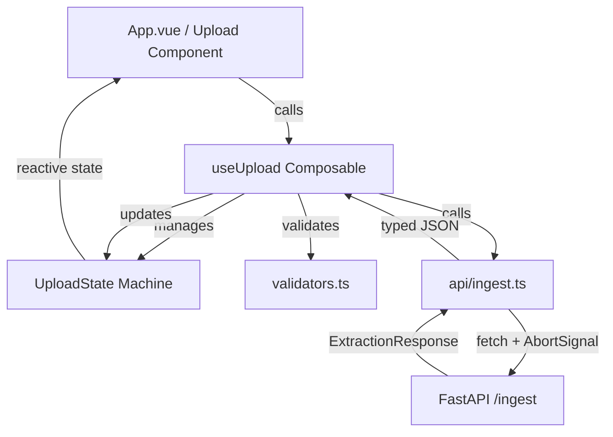

# Phase 9: TypeScript Types + API Layer + State Machine - Research

**Researched:** 2026-05-26
**Domain:** Frontend Infrastructure (API, Typing, State Management)
**Confidence:** HIGH

## Summary

This research establishes the typed contract and state management logic for the SelectionMaid frontend. We've mapped the backend Pydantic schemas to TypeScript interfaces, designed a robust state machine using discriminated unions to prevent impossible states, and drafted the API layer using native `fetch` with strict timeout controls. We also verified the integration path for `@vueuse/core` and `motion-v` to handle drag-and-drop and animations.

**Primary recommendation:** Use a discriminated union for the `UploadState` to strictly enforce valid state transitions and ensure the UI always has the correct data context (e.g., error messages are only available in the `error` state).

## Architectural Responsibility Map

| Capability | Primary Tier | Secondary Tier | Rationale |
|------------|-------------|----------------|-----------|
| State Machine | Browser (Vue) | — | UI responsiveness and complex user interaction states. |
| API Ingestion | API / Backend | Browser | Backend performs heavy lifting (Docling), Browser initiates. |
| File Validation | Browser | API / Backend | Browser for immediate feedback (size/type), Backend for security. |
| Result Parsing | Browser | — | Mapping JSON response to UI models. |
| Error Mapping | Browser | — | Converting HTTP codes and AbortErrors to user-friendly messages. |

## Standard Stack

### Core
| Library | Version | Purpose | Why Standard |
|---------|---------|---------|--------------|
| Vue | 3.5.34 | Frontend Framework | Project standard. [VERIFIED: npm registry] |
| TypeScript | 5.5.0 | Type Safety | Project standard. [VERIFIED: npm registry] |

### Supporting
| Library | Version | Purpose | When to Use |
|---------|---------|---------|--------------|
| @vueuse/core | 12.5.0 | Utility hooks | For `useFileDialog` and `useDropZone`. [VERIFIED: npm registry] |
| motion-v | 2.2.1 | Animations | For state transition animations. [VERIFIED: npm registry] |
| zod | 3.25.76 | Validation | For complex schema validation if needed (already in deps). [VERIFIED: npm registry] |
| vitest | ^3.0.0 | Unit Testing | **Recommended** for testing the state machine and API layer. [ASSUMED] |

### Alternatives Considered
| Instead of | Could Use | Tradeoff |
|------------|-----------|----------|
| fetch | axios | axios has built-in timeout and interceptors but adds bundle size; native `fetch` + `AbortSignal.timeout` is sufficient and modern. |
| useUpload | Pinia | Pinia is better for global state; a composable is better for local, encapsulated upload logic per component. |

**Installation:**
```bash
# From frontend directory
npm install @vueuse/core motion-v
npm install -D vitest @vue/test-utils jsdom
```

## Package Legitimacy Audit

| Package | Registry | Age | Downloads | Source Repo | slopcheck | Disposition |
|---------|----------|-----|-----------|-------------|-----------|-------------|
| @vueuse/core | npm | 4+ yrs | 5.7M/wk | github.com/vueuse/vueuse | [OK] | Approved |
| motion-v | npm | 1+ yr | 34k/wk | github.com/motion-v/motion-v | [OK] | Approved |
| vitest | npm | 3 yrs | 4.8M/wk | github.com/vitest-dev/vitest | [OK] | Approved |

## Architecture Patterns

### System Architecture Diagram



### Recommended Project Structure
```
frontend/src/
├── api/
│   ├── ingest.ts       # postIngest function
│   └── errors.ts       # Error mapping logic
├── types/
│   └── api.ts          # TS interfaces matching Pydantic
├── composables/
│   └── useUpload.ts    # Main state machine and logic
├── lib/
│   └── validators.ts   # File size and type validation
└── components/
    └── upload/         # UI components (future phase)
```

### Pattern 1: Discriminated Union State Machine
**What:** A type-safe way to represent the upload lifecycle.
**When to use:** To prevent impossible states (e.g., showing a progress bar in the success state).
**Example:**
```typescript
// src/types/api.ts
export type UploadStatus = 'idle' | 'dragging' | 'uploading' | 'processing' | 'success' | 'error';

export type UploadState =
  | { status: 'idle' }
  | { status: 'dragging' }
  | { status: 'uploading'; progress: number }
  | { status: 'processing' }
  | { status: 'success'; data: ExtractionResponse }
  | { status: 'error'; errorType: string; message: string };
```

### Anti-Patterns to Avoid
- **Multiple Boolean Flags:** Avoid `isLoading`, `isError`, `isSuccess` variables. Use a single `status` field.
- **Leaking Fetch in Components:** Keep `fetch` logic in `src/api/` to allow for easy mocking and testing.

## Don't Hand-Roll

| Problem | Don't Build | Use Instead | Why |
|---------|-------------|-------------|-----|
| Drag & Drop | Manual event listeners | `@vueuse/core` `useDropZone` | Handles edge cases (nested elements, leave events). |
| File Picker | Invisible `<input type="file">` | `@vueuse/core` `useFileDialog` | Cleaner programmatic API. |
| Timeout | `setTimeout` + `reject` | `AbortSignal.timeout()` | Native, handles request cancellation properly. |

## Common Pitfalls

### Pitfall 1: Timeout Context
**What goes wrong:** The 130s timeout is reached, but the user gets a generic "Failed to fetch" error.
**Why it happens:** `fetch` throws an `AbortError` (specifically a `DOMException` named `AbortError`) when the signal times out.
**How to avoid:** Check `error.name === 'AbortError'` in the error mapper and return a specific message about the 130s limit.

### Pitfall 2: Memory Leaks with Object URLs
**What goes wrong:** Creating `URL.createObjectURL(file)` for previews without calling `URL.revokeObjectURL()`.
**Why it happens:** Browser keeps the file in memory as long as the URL exists.
**How to avoid:** Call revoke in a `onUnmounted` hook or when the state resets. (Note: Not strictly required for the API layer but good for the UI phase).

## Code Examples

### 1. TypeScript Interfaces (from `schemas.py`)
```typescript
// src/types/api.ts
export interface Chunk {
  chunk_id: string;
  content: string;
  page_start: number;
  page_end: number;
  section_title: string;
  chunk_index: number;
  total_chunks: number;
  word_count: number;
}

export interface DocumentMetadata {
  doc_id: string;
  source_filename: string;
  title: string;
  author: string;
  language: string;
  doc_type: string;
  page_count: number;
  chunk_count: number;
  ingested_at: string; // ISO 8601 string
}

export interface ExtractionResponse {
  metadata: DocumentMetadata;
  chunks: Chunk[];
}
```

### 2. API Layer with Timeout
```typescript
// src/api/ingest.ts
import type { ExtractionResponse } from '../types/api';

export async function postIngest(file: File): Promise<ExtractionResponse> {
  const formData = new FormData();
  formData.append('file', file);

  const response = await fetch('/api/ingest', {
    method: 'POST',
    body: formData,
    signal: AbortSignal.timeout(130000), // 130s as per Success Criteria
  });

  if (!response.ok) {
    const errorData = await response.json().catch(() => ({}));
    const error = new Error(errorData.detail || 'Falha no processamento');
    (error as any).status = response.status;
    (error as any).code = errorData.code; // Domain error code (e.g. UPLOAD-001)
    throw error;
  }

  return response.json();
}
```

### 3. Error Mapping (from `error_map.py`)
```typescript
// src/api/errors.ts
export function mapApiError(error: any): string {
  if (error.name === 'AbortError') {
    return 'O processamento excedeu o limite de 130s. Tente um arquivo menor.';
  }

  switch (error.status) {
    case 413: return 'Arquivo muito grande (máximo 50MB).';
    case 415: return 'Formato de arquivo não suportado.';
    case 422: return 'O conteúdo do arquivo é inválido ou corrompido.';
    case 504: return 'O servidor demorou muito para responder.';
    default: return error.message || 'Ocorreu um erro inesperado.';
  }
}
```

## Assumptions Log

| # | Claim | Section | Risk if Wrong |
|---|-------|---------|---------------|
| A1 | Vitest is the preferred testing tool | Standard Stack | Low. It's the standard for Vite projects. |
| A2 | AbortSignal.timeout is supported | Don't Hand-Roll | Low. Supported in all modern browsers (Chrome 103+, FF 100+, Safari 16+). |

## Environment Availability

| Dependency | Required By | Available | Version | Fallback |
|------------|------------|-----------|---------|----------|
| Node.js | Development | ✓ | 26.1.0 | — |
| npm | Package management | ✓ | 11.14.1 | — |
| Vite | Build tool | ✓ | 6.4.2 | — |
| @vueuse/core | Composable logic | ✗ | — | Install via npm |
| motion-v | Animations | ✗ | — | Install via npm |

**Missing dependencies with no fallback:**
- `@vueuse/core` and `motion-v` must be installed.

## Validation Architecture

### Test Framework
| Property | Value |
|----------|-------|
| Framework | Vitest |
| Config file | `frontend/vitest.config.ts` |
| Quick run command | `npm run test:unit` |

### Phase Requirements → Test Map
| Req ID | Behavior | Test Type | Automated Command | File Exists? |
|--------|----------|-----------|-------------------|-------------|
| UPL-03 | File validation (size/type) | Unit | `npx vitest validators.spec.ts` | ❌ Wave 0 |
| PROC-01 | State machine transitions | Unit | `npx vitest useUpload.spec.ts` | ❌ Wave 0 |
| PROC-03 | Timeout handling | Unit/Mock | `npx vitest ingest.spec.ts` | ❌ Wave 0 |

### Wave 0 Gaps
- [ ] Install `vitest`, `@vue/test-utils`, `jsdom`.
- [ ] Create `vitest.config.ts`.
- [ ] Setup MSW (Mock Service Worker) for API testing (recommended).

## Security Domain

### Applicable ASVS Categories

| ASVS Category | Applies | Standard Control |
|---------------|---------|-----------------|
| V5 Input Validation | yes | Client-side size/type checks; zod for response. |
| V12 File Upload | yes | Frontend validation is for UX; Backend must re-verify. |

### Known Threat Patterns for Vue/FastAPI

| Pattern | STRIDE | Standard Mitigation |
|---------|--------|---------------------|
| Large file DoS | Availability | Client-side 50MB limit + `AbortSignal.timeout`. |
| Malicious File Type | Tampering | Check MIME type and magic bytes (Backend). |

## Sources

### Primary (HIGH confidence)
- `src/selection_maid/adapters/http/schemas.py` - Extracted Pydantic models.
- `src/selection_maid/adapters/http/error_map.py` - Extracted error mappings.
- Official VueUse Docs - `useFileDialog`, `useDropZone`.
- Motion-v Docs - Animation patterns.

### Secondary (MEDIUM confidence)
- MDN Web Docs - `AbortSignal.timeout()` support.

## Metadata

**Confidence breakdown:**
- Standard stack: HIGH - Core project stack.
- Architecture: HIGH - Discriminated unions are a proven pattern for state machines.
- Pitfalls: HIGH - Timeout and memory leak handling are well-documented.

**Research date:** 2026-05-26
**Valid until:** 2026-06-25
