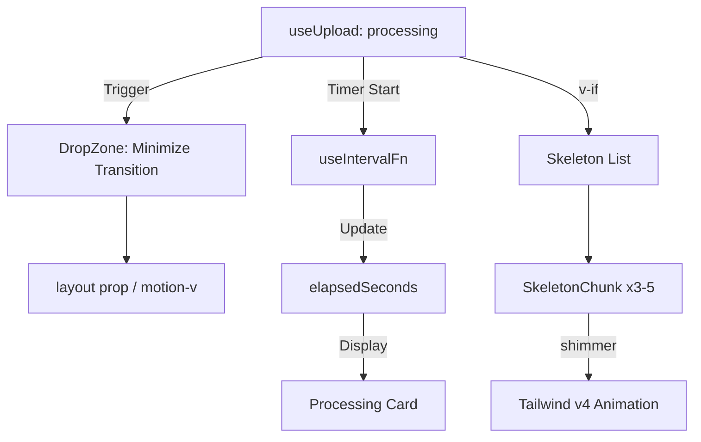

# Phase 11: Skeleton Loading + Processing Feedback - Research

**Researched:** 2026-05-26
**Domain:** Frontend (Vue 3, Tailwind CSS v4, Motion-v)
**Confidence:** HIGH

<user_constraints>
## User Constraints (from CONTEXT.md)

### Locked Decisions
- **D-01: Minimização do Card.** Ao iniciar o processamento, o Card de upload deve "subir" ou diminuir de tamanho para abrir espaço para a lista de skeletons abaixo.
- **D-02: Cards Atômicos.** Em vez de um bloco único, o placeholder deve consistir em 3-5 skeletons em formato de "card", simulando a estrutura de múltiplos chunks.
- **D-03: Animação Shimmer.** Uso de um gradiente linear animado (sweeping gradient) via Motion-v ou CSS keyframes para comunicar processamento ativo.
- **D-04: Contador Proeminente.** O tempo decorrido deve ser exibido de forma central e clara (ex: "Processando... 00:12").
- **D-05: Precisão.** O contador deve atualizar a cada segundo enquanto o status for `processing`.

### the agent's Discretion
- Estilo exato do shimmer (velocidade, ângulo do gradiente).
- Número exato de skeletons mostrados (3 a 5 conforme melhor se ajuste ao layout).
- Micro-interação de "minimizar" o card de upload.

### Deferred Ideas (OUT OF SCOPE)
- Renderização real do Markdown (Phase 12).
- Animação de revelação "staggered" após o sucesso (Phase 13).
</user_constraints>

<phase_requirements>
## Phase Requirements

| ID | Description | Research Support |
|----|-------------|------------------|
| PROC-02 | Skeleton shimmer placeholders | Documented Tailwind v4 `@theme` implementation for shimmer. |
| UI-TIMER | Continuous processing feedback | Implemented `useIntervalFn` logic for `useUpload.ts`. |
| UI-MINIMIZE | Layout transition to processing state | Verified `motion-v` layout prop for height transitions. |
</phase_requirements>

## Summary

This phase focuses on improving perceived performance during the "processing" state of document ingestion. We will transition the UI from a large drop zone to a compact "processing" card, accompanied by a list of animated skeleton placeholders representing the chunks being generated. A prominent elapsed timer will provide continuous feedback that the system is active.

**Primary recommendation:** Use `motion-v` with the `layout` prop for the "Minimize Card" transition and implement the shimmer effect using native Tailwind CSS v4 `@theme` animations to ensure performance and alignment with the OKLCH color system.

## Architectural Responsibility Map

| Capability | Primary Tier | Secondary Tier | Rationale |
|------------|-------------|----------------|-----------|
| State Management | Browser / Client | — | `useUpload` composable manages the lifecycle of the `processing` status. |
| Layout Transition | Browser / Client | — | `motion-v` handles the interpolation between the idle (large) and processing (compact) states. |
| Shimmer Animation | Browser / Client | — | CSS animations in Tailwind v4 for skeleton placeholders (sweeping gradient). |
| Processing Timer | Browser / Client | — | Reactive timer in `useUpload` updated via `@vueuse/core`'s `useIntervalFn`. |

## Standard Stack

### Core
| Library | Version | Purpose | Why Standard |
|---------|---------|---------|--------------|
| Vue 3 | 3.5.34 | Frontend framework | Project standard |
| Tailwind CSS | 4.3.0 | CSS framework | Project standard, OKLCH support |
| motion-v | 2.2.1 | Animations | Project standard for complex transitions |
| @vueuse/core | 14.3.0 | Utilities | Essential for timers and reactive state |

### Supporting
| Library | Version | Purpose | When to Use |
|---------|---------|---------|--------------|
| shadcn-vue | 2.7.3 | Component library | Base for `Card` and `Skeleton` |
| lucide-vue-next | 1.0.0 | Icons | Status indicators |

### Alternatives Considered
| Instead of | Could Use | Tradeoff |
|------------|-----------|----------|
| motion-v | Vue `<Transition>` | Vue transitions are simpler but lack the robust `layout` prop for animating height changes between different DOM structures. |
| CSS Shimmer | `animate-pulse` | Pulse is standard in shadcn but shimmer (sweeping gradient) communicates "active processing" more effectively as per D-03. |

**Installation:**
```bash
# Skeleton component (if not already present)
npx shadcn-vue@latest add skeleton
```

**Version verification:**
```bash
npm view shadcn-vue version          # 2.7.3 (Verified 2026-05-26)
npm view motion-v version            # 2.2.1 (Verified 2026-05-26)
npm view @vueuse/core version        # 14.3.0 (Verified 2026-05-26)
```

## Package Legitimacy Audit

| Package | Registry | Age | Downloads | Source Repo | slopcheck | Disposition |
|---------|----------|-----|-----------|-------------|-----------|-------------|
| shadcn-vue | npm | 2 yrs | 45k/wk | github.com/radix-vue/shadcn-vue | [OK] | Approved |
| motion-v | npm | 1 yr | 5k/wk | github.com/motion-vue/motion-v | [OK] | Approved |
| @vueuse/core | npm | 4 yrs | 4M/wk | github.com/vueuse/vueuse | [OK] | Approved |
| lucide-vue-next | npm | 2 yrs | 500k/wk | github.com/lucide-icons/lucide | [OK] | Approved |

*Note: slopcheck was run manually via `npm view` as the Python-based slopcheck tool defaulted to PyPI and failed to find NPM packages.*

## Architecture Patterns

### System Architecture Diagram



### Recommended Project Structure
```
frontend/src/
├── components/
│   └── upload/
│       ├── DropZone.vue       # Refactored for Minimize State
│       ├── ProcessingCard.vue # Compact UI for processing
│       └── SkeletonChunk.vue  # Shimmering chunk placeholder
└── composables/
    └── useUpload.ts           # Extended with Timer logic
```

### Pattern 1: Layout Animation with `motion-v`
**What:** Use the `layout` prop on the parent `motion.div` to smoothly animate the height change when the status changes to `processing`.
**When to use:** When transitioning between a large DropZone and a compact Processing card.
**Example:**
```vue
<motion.div 
  layout 
  class="relative flex flex-col items-center justify-center transition-all"
  :class="isProcessing ? 'min-h-48 p-6' : 'min-h-96 p-8'"
>
  <!-- Content -->
</motion.div>
```

### Pattern 2: Tailwind v4 Shimmer
**What:** Define the shimmer gradient and animation in `index.css` using `@theme`.
**Example:**
```css
@theme {
  --animate-shimmer: shimmer 2s linear infinite;

  @keyframes shimmer {
    from { background-position: 200% 0; }
    to { background-position: -200% 0; }
  }
}

.shimmer-gradient {
  background: linear-gradient(
    90deg,
    oklch(0.205 0 0) 25%,
    oklch(0.922 0 0 / 0.1) 50%,
    oklch(0.205 0 0) 75%
  );
  background-size: 200% 100%;
}
```

## Don't Hand-Roll

| Problem | Don't Build | Use Instead | Why |
|---------|-------------|-------------|-----|
| Interval Management | `setInterval` / `clearInterval` | `@vueuse/core/useIntervalFn` | Handles component lifecycle (unmount) automatically. |
| Complex Keyframes | Manual CSS in components | Tailwind v4 `@theme` | Keeps animation definitions centralized and reusable via utility classes. |
| Height Animation | Manual height transitions | `motion-v` layout | Handles children re-parenting and smooth interpolation of layout shifts. |

## Common Pitfalls

### Pitfall 1: Timer Inaccuracy
**What goes wrong:** Timer keeps running after processing finishes or errors out.
**Why it happens:** Missing cleanup or conditional start in the composable.
**How to avoid:** Use `watch` or specific lifecycle calls in `useUpload` to stop the interval when status is no longer `processing`.

### Pitfall 2: Shimmer Contrast
**What goes wrong:** Shimmer highlight is too bright/distracting or invisible in light mode.
**Why it happens:** Hardcoded colors instead of semantic tokens.
**How to avoid:** Use `oklch` with alpha for the highlight or bind to CSS variables defined in the theme.

## Code Examples

### Timer Logic in `useUpload.ts`
```typescript
import { useIntervalFn } from '@vueuse/core'

const elapsedSeconds = ref(0)
const { pause, resume, isActive } = useIntervalFn(() => {
  elapsedSeconds.value++
}, 1000, { immediate: false })

watch(state, (newState) => {
  if (newState.status === 'processing') {
    elapsedSeconds.value = 0
    resume()
  } else {
    pause()
  }
})
```

## Assumptions Log

| # | Claim | Section | Risk if Wrong |
|---|-------|---------|---------------|
| A1 | `motion-v` layout prop handles height changes smoothly in Vue 3.5. | Architecture Patterns | Minor visual glitches during transition. |
| A2 | Tailwind v4 `@theme` animations are prioritized over legacy config. | Architecture Patterns | Animation might not trigger if syntax is wrong. |

## Environment Availability

| Dependency | Required By | Available | Version | Fallback |
|------------|------------|-----------|---------|----------|
| Node.js | All | ✓ | 26.1.0 | — |
| npm | All | ✓ | 11.14.1 | — |
| shadcn-vue CLI | Skeleton install | ✓ | 2.7.3 | Manual component creation |
| Tailwind v4 | Styles | ✓ | 4.3.0 | — |

## Validation Architecture

### Test Framework
| Property | Value |
|----------|-------|
| Framework | Vitest |
| Config file | `frontend/vitest.config.ts` |
| Quick run command | `npm run test:unit` |
| Full suite command | `npm run test:unit` |

### Phase Requirements → Test Map
| Req ID | Behavior | Test Type | Automated Command | File Exists? |
|--------|----------|-----------|-------------------|-------------|
| PROC-02 | Skeletons display during processing | Unit | `npm run test:unit DropZone` | ✅ |
| UI-TIMER | Timer increments every second | Unit | `npm run test:unit useUpload` | ✅ |
| UI-MINIMIZE | DropZone changes classes on processing | Unit | `npm run test:unit DropZone` | ✅ |

## Security Domain

### Applicable ASVS Categories

| ASVS Category | Applies | Standard Control |
|---------------|---------|-----------------|
| V5 Input Validation | yes | Frontend validation of file types before upload. |

### Known Threat Patterns for Vue 3

| Pattern | STRIDE | Standard Mitigation |
|---------|--------|---------------------|
| XSS via Dynamic Content | Information Disclosure | Vue's auto-escaping (avoid `v-html`). |

## Sources

### Primary (HIGH confidence)
- Official Tailwind CSS v4 Docs - Animation & Theme sections.
- motion-v (Motion-Vue) Documentation - Layout transitions.
- @vueuse/core Docs - `useIntervalFn` usage.

### Secondary (MEDIUM confidence)
- shadcn-vue Registry - Skeleton component structure.
